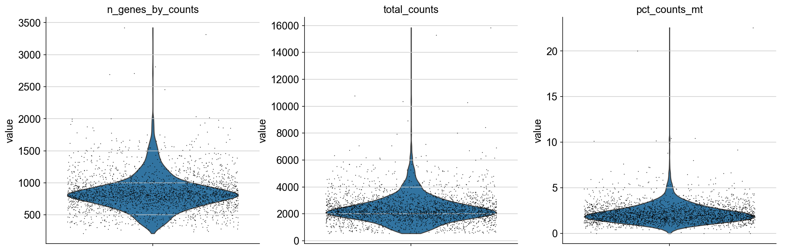
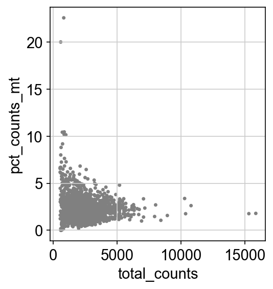
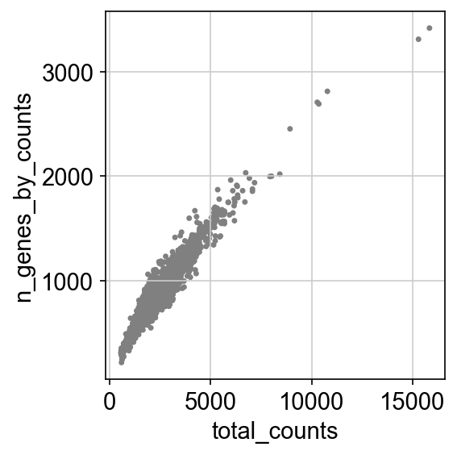
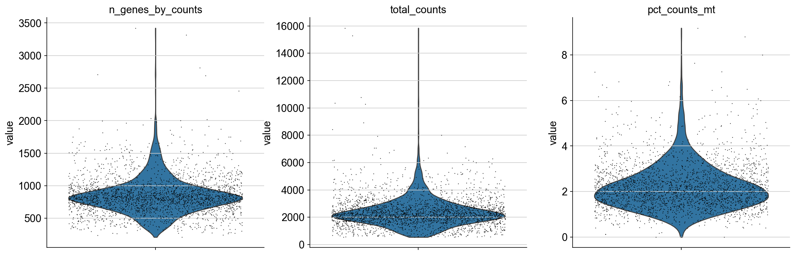
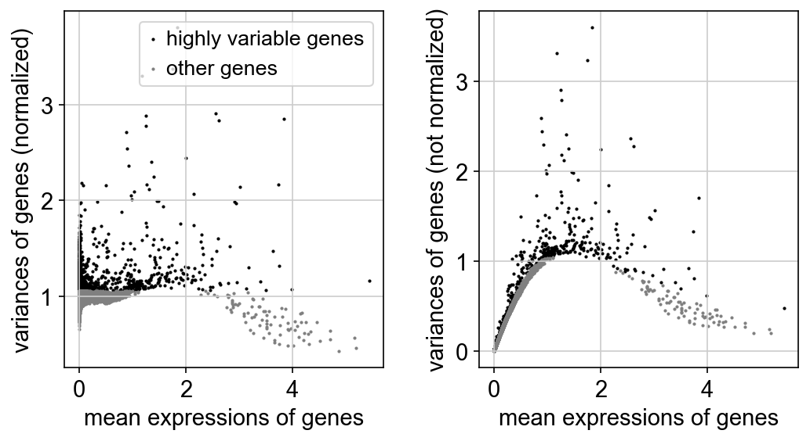
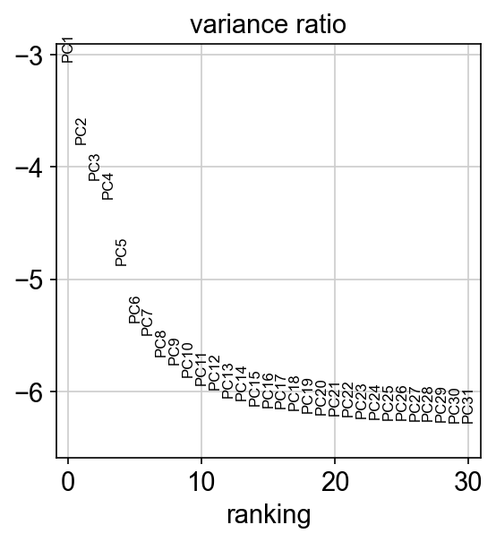
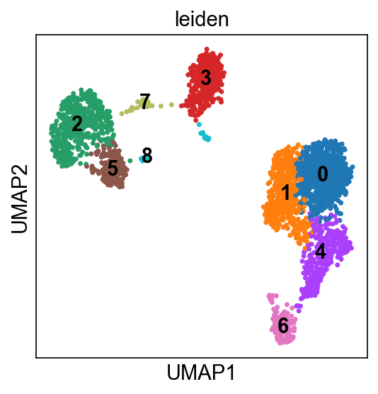
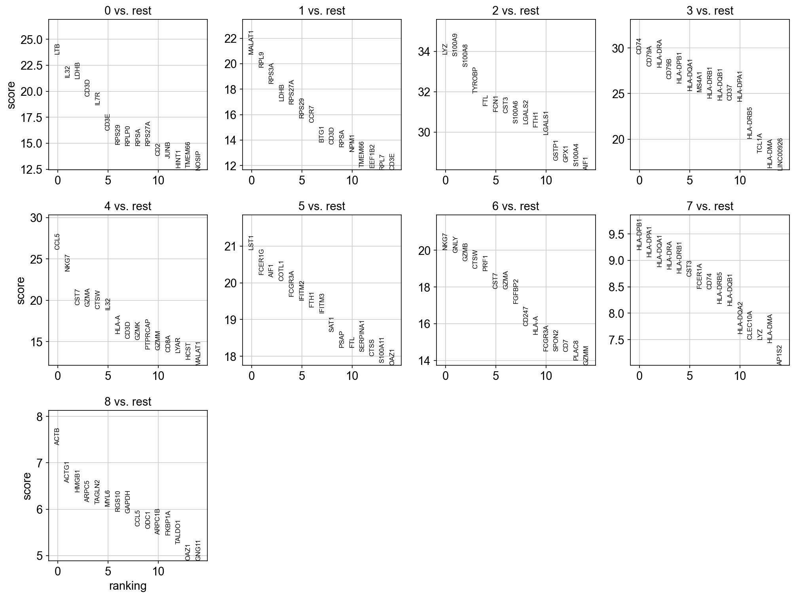

# PBMC3k QC + Clustering Review Report

**Generated:** 2026-01-31 13:51:53
**Artifacts:** `outputs`

## 1) Run Summary

|   cells_retained |   genes_retained |   hvgs_used |   clusters |   leiden_resolution |   n_neighbors |   n_pcs |
|-----------------:|-----------------:|------------:|-----------:|--------------------:|--------------:|--------:|
|             2694 |            13714 |        2000 |          9 |                 0.6 |            10 |      30 |

## 2) QC Summary

|   cells_raw |   genes_raw |   cells_retained |   genes_retained |   median_genes_per_cell |   median_umis_per_cell |   median_pct_mito |   min_genes_filter |   min_cells_filter |   max_pct_mito_filter |
|------------:|------------:|-----------------:|-----------------:|------------------------:|-----------------------:|------------------:|-------------------:|-------------------:|----------------------:|
|        2700 |       32738 |             2694 |            13714 |                     817 |                   2200 |           2.02753 |                200 |                  3 |                    10 |

## 3) Key Visualizations

### QC violin (before filtering)

### QC scatter: counts vs % mito (before)

### QC scatter: counts vs genes (before)

### QC violin (after filtering)

### Highly variable genes (HVGs)

### PCA variance ratio

### UMAP with Leiden clusters

### Top marker genes (per cluster)

## 4) Top Marker Genes per Cluster

|   group | names     |   scores |   logfoldchanges |        pvals |    pvals_adj |
|--------:|:----------|---------:|-----------------:|-------------:|-------------:|
|       0 | LTB       |  23.5735 |              nan | 7.20935e-123 | 1.44187e-119 |
|       0 | IL32      |  21.3524 |              nan | 3.70392e-101 | 3.70392e-98  |
|       0 | LDHB      |  21.2273 |              nan | 5.34033e-100 | 3.56022e-97  |
|       0 | CD3D      |  19.4966 |              nan | 1.17345e-84  | 5.86725e-82  |
|       0 | IL7R      |  18.7173 |              nan | 3.57914e-78  | 1.19305e-75  |
|       0 | CD3E      |  16.2222 |              nan | 3.51644e-59  | 5.86074e-57  |
|       0 | RPS29     |  14.907  |              nan | 2.97001e-50  | 3.71251e-48  |
|       0 | RPLP0     |  14.8049 |              nan | 1.36178e-49  | 1.51308e-47  |
|       0 | RPSA      |  14.7977 |              nan | 1.51659e-49  | 1.59641e-47  |
|       0 | RPS27A    |  14.7758 |              nan | 2.09777e-49  | 2.09777e-47  |
|       0 | CD2       |  13.8078 |              nan | 2.28709e-43  | 2.07917e-41  |
|       0 | JUNB      |  13.5778 |              nan | 5.42206e-42  | 4.71484e-40  |
|       0 | HINT1     |  12.6683 |              nan | 8.86459e-37  | 6.78145e-35  |
|       0 | TMEM66    |  12.6552 |              nan | 1.04714e-36  | 7.47955e-35  |
|       0 | NOSIP     |  12.4456 |              nan | 1.47798e-35  | 1.0193e-33   |
|       1 | MALAT1    |  20.7492 |              nan | 1.24667e-95  | 1.24667e-92  |
|       1 | RPL9      |  19.7192 |              nan | 1.47442e-86  | 7.37209e-84  |
|       1 | RPS3A     |  18.4441 |              nan | 5.8201e-76   | 1.66289e-73  |
|       1 | LDHB      |  17.0839 |              nan | 1.95435e-65  | 3.55336e-63  |
|       1 | RPS27A    |  16.8286 |              nan | 1.50654e-63  | 2.31775e-61  |
|       1 | RPS29     |  15.7393 |              nan | 8.13466e-56  | 7.39515e-54  |
|       1 | CCR7      |  15.3896 |              nan | 1.92074e-53  | 1.60061e-51  |
|       1 | BTG1      |  13.8706 |              nan | 9.54711e-44  | 5.96694e-42  |
|       1 | CD3D      |  13.6756 |              nan | 1.41966e-42  | 8.35092e-41  |
|       1 | RPSA      |  13.4853 |              nan | 1.90875e-41  | 1.03176e-39  |
|       1 | NPM1      |  13.0944 |              nan | 3.54287e-39  | 1.81686e-37  |
|       1 | TMEM66    |  11.8762 |              nan | 1.57421e-32  | 6.84438e-31  |
|       1 | EEF1B2    |  11.834  |              nan | 2.60571e-32  | 1.10881e-30  |
|       1 | RPL7      |  11.6832 |              nan | 1.55251e-31  | 6.46877e-30  |
|       1 | CD3E      |  11.6644 |              nan | 1.937e-31    | 7.90614e-30  |
|       2 | LYZ       |  33.8668 |              nan | 2.0564e-251  | 4.1128e-248  |
|       2 | S100A9    |  33.7668 |              nan | 6.06242e-250 | 6.06242e-247 |
|       2 | S100A8    |  33.2433 |              nan | 2.5511e-242  | 1.70073e-239 |
|       2 | TYROBP    |  31.9302 |              nan | 1.01636e-223 | 5.08182e-221 |
|       2 | FTL       |  31.323  |              nan | 2.27212e-215 | 9.08846e-213 |
|       2 | FCN1      |  31.0282 |              nan | 2.24756e-211 | 7.49185e-209 |
|       2 | CST3      |  30.9576 |              nan | 2.0091e-210  | 5.7403e-208  |
|       2 | S100A6    |  30.4295 |              nan | 2.23517e-203 | 5.58792e-201 |
|       2 | LGALS2    |  30.4197 |              nan | 3.01469e-203 | 6.69931e-201 |
|       2 | FTH1      |  30.2579 |              nan | 4.10442e-201 | 7.46257e-199 |
|       2 | LGALS1    |  29.8808 |              nan | 3.49132e-196 | 5.81886e-194 |
|       2 | GSTP1     |  28.5921 |              nan | 8.41538e-180 | 1.29467e-177 |
|       2 | GPX1      |  28.5148 |              nan | 7.66827e-179 | 1.09547e-176 |
|       2 | S100A4    |  28.3134 |              nan | 2.36092e-176 | 3.1479e-174  |
|       2 | AIF1      |  28.1341 |              nan | 3.74961e-174 | 4.68701e-172 |
|       3 | CD74      |  29.3203 |              nan | 5.72442e-189 | 1.14488e-185 |
|       3 | CD79A     |  27.9879 |              nan | 2.28292e-172 | 2.28292e-169 |
|       3 | HLA-DRA   |  27.9163 |              nan | 1.69153e-171 | 1.12768e-168 |
|       3 | CD79B     |  26.5839 |              nan | 1.04155e-155 | 5.20777e-153 |
|       3 | HLA-DPB1  |  26.1459 |              nan | 1.09754e-150 | 4.39015e-148 |
|       3 | HLA-DQA1  |  25.3511 |              nan | 8.74861e-142 | 2.9162e-139  |
|       3 | MS4A1     |  25.2266 |              nan | 2.0466e-140  | 5.84742e-138 |
|       3 | HLA-DRB1  |  24.4995 |              nan | 1.49433e-132 | 3.73582e-130 |
|       3 | HLA-DQB1  |  24.3041 |              nan | 1.77275e-130 | 3.93944e-128 |
|       3 | CD37      |  24.249  |              nan | 6.77771e-130 | 1.35554e-127 |
|       3 | HLA-DPA1  |  24.163  |              nan | 5.45607e-129 | 9.92013e-127 |
|       3 | HLA-DRB5  |  20.1077 |              nan | 6.32157e-90  | 9.72549e-88  |
|       3 | TCL1A     |  18.4781 |              nan | 3.09941e-76  | 4.13254e-74  |
|       3 | HLA-DMA   |  16.892  |              nan | 5.1529e-64   | 5.72544e-62  |
|       3 | LINC00926 |  16.642  |              nan | 3.45646e-62  | 3.45646e-60  |

Full table: `outputs/tables/marker_genes_top15_per_cluster.csv`

## 5) Output Files

- Figures: `outputs/figures/`
- Tables: `outputs/tables/`
- Report (Markdown): `outputs/report.md`
- Report (HTML): `outputs/report.html`
